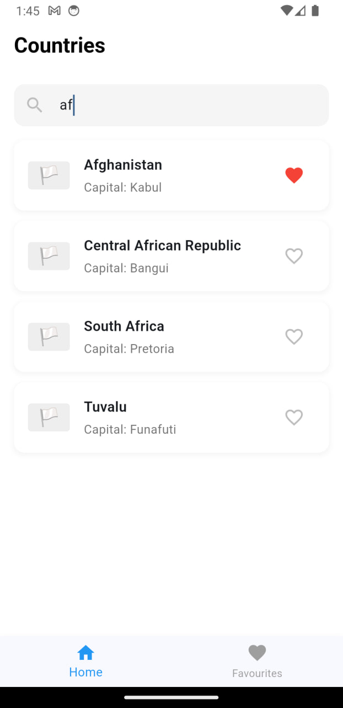

# Flutter Countries App

A beautiful and modern Flutter application that displays information about countries around the world. The app fetches data from the REST Countries API and provides a seamless user experience for exploring country details and managing favorites.

## 📱 Screenshots

### Home Screen

- Clean and modern UI design
- Search functionality
- List of countries with flags
- Favorite toggle functionality

### Country Details

- Detailed country information
- Population statistics
- Geographic data
- Timezone information

### Search Feature

- Real-time search filtering
- Search by country name or capital
- Responsive and smooth updates

### Favorites Page

- Dedicated favorites section
- Easy management of favorite countries
- Persistent storage of favorites

## ✨ Features

- **Country List**: Browse through a comprehensive list of countries with their flags and basic information
- **Search Functionality**: Easily search for countries by name or capital
- **Favorites System**: Add/remove countries to/from favorites with persistent storage
- **Detailed Information**: View detailed information about each country including:
  - Official flag
  - Capital city
  - Population
  - Area
  - Region and subregion
  - Timezones

## 🛠️ Technical Details

### API Integration
The app uses the [REST Countries API](https://restcountries.com/) to fetch country data with the following endpoints:
- `https://restcountries.com/v3.1/all` - Fetches all countries with selected fields

### State Management
- Uses Flutter's built-in `setState` for state management
- Implements `GetStorage` for persistent storage of favorites

### Key Dependencies
```yaml
dependencies:
  flutter:
    sdk: flutter
  http: ^1.1.0
  get_storage: ^2.1.1
```

## 🚀 Getting Started

1. **Clone the repository**
```bash
git clone [your-repository-url]
```

2. **Install dependencies**
```bash
flutter pub get
```

3. **Run the app**
```bash
flutter run
```

## 📝 Implementation Details

### Data Persistence
- Favorites are stored locally using `GetStorage`
- Automatic loading and saving of favorite countries

### Error Handling
- Comprehensive error handling for API calls
- User-friendly error messages
- Retry mechanism for failed API requests

### Performance Optimizations
- Efficient search filtering
- Optimized list rendering
- Proper state management to prevent unnecessary rebuilds

## 🤝 Contributing

Contributions, issues, and feature requests are welcome! Feel free to check [issues page].

## 📄 License

This project is licensed under the MIT License - see the [LICENSE] file for details.
